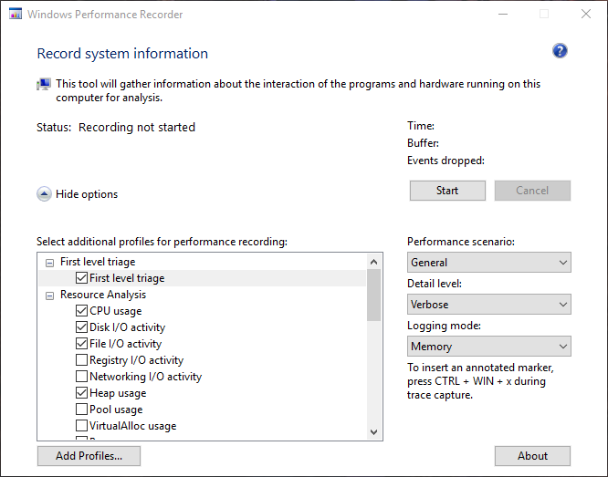
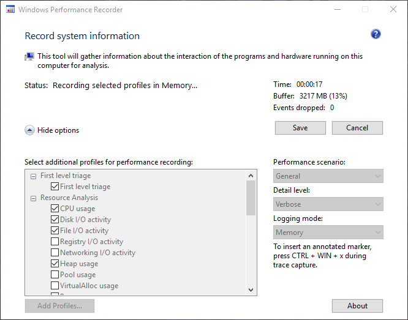
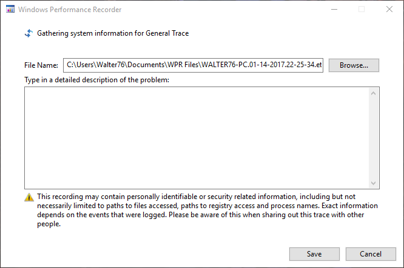
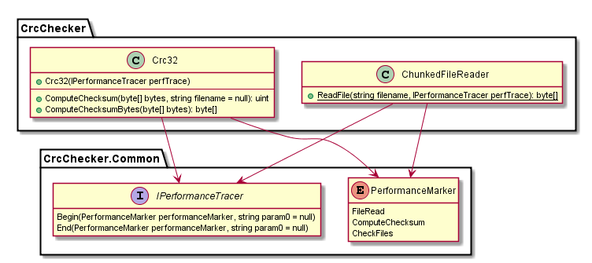
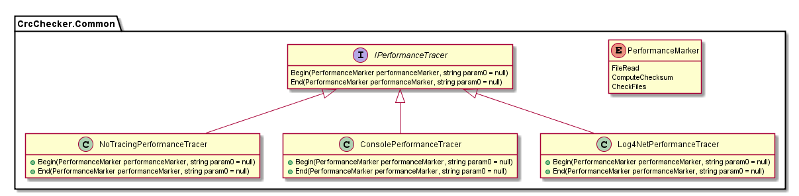
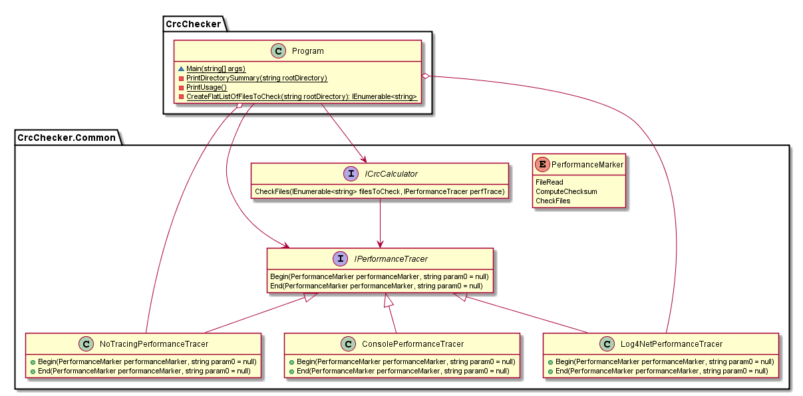
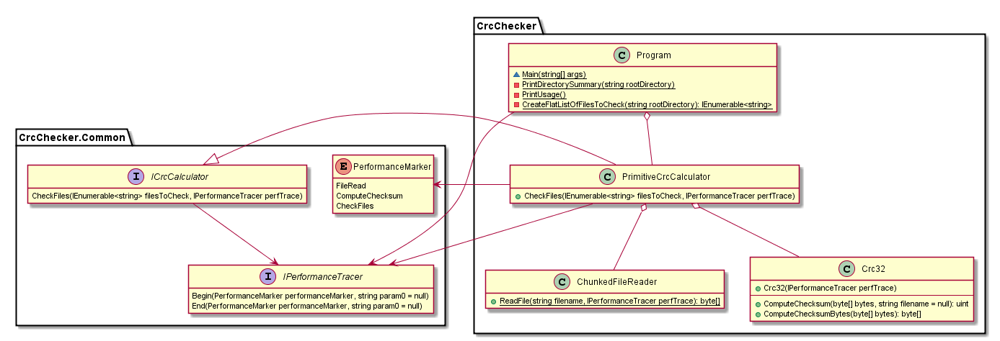
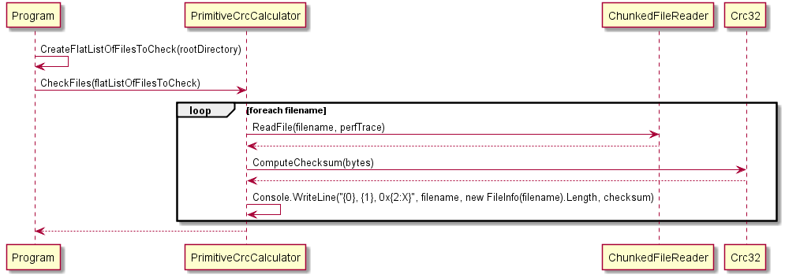
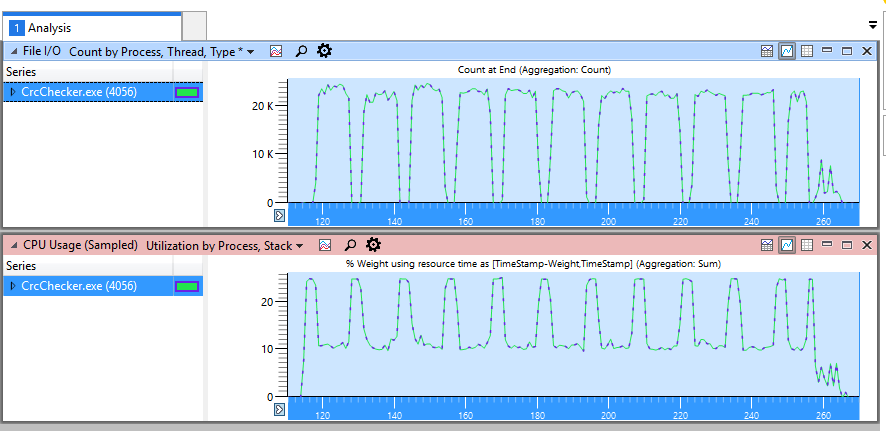
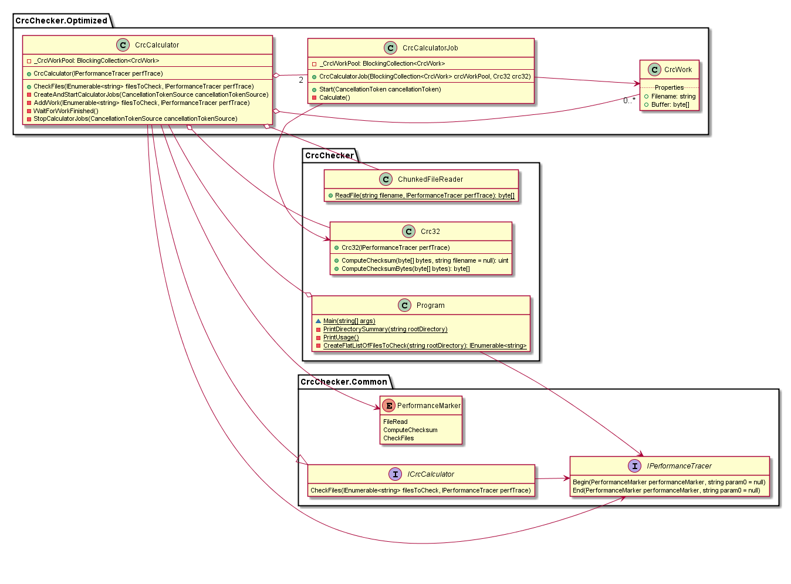

## Introduction

The idea is to build a fast implementation for creating checksums from binary
files in C#. The solution should be able to read all files in a directory and
its subdirectories, calculate a CRC32-checksum for each file and print the
result to the console.

I am aware that there are already a lot of good CRC-Checkers available. My
primary goal is not to have a fast implementation, but to learn something about
optimization (multi-threading) on Windows with .NET and performance analysis
with the [Windows Performance Toolkit](https://msdn.microsoft.com/en-us/windows/hardware/commercialize/test/wpt/index).

By posting this article I hope that others can also benefit from my learning
experience.

## CRC32 Algorithm

A cyclic redundancy check (CRC) is an error-detecting code commonly used in
digital networks and storage devices to detect accidental changes to raw data.
The CRC was invented by W. Wesley Peterson in 1961; the 32-bit CRC function of
Ethernet and many other standards is the work of several researchers and was
published in 1975. (see [Cyclic redundancy check](https://en.wikipedia.org/wiki/Cyclic_redundancy_check))

We will use this algorithm to calculate the checksum for each file in the
directory. As I didn't want to invent my own implementation of the CRC32, I
googled for an solution that is already available. After a while I came up with
[this](http://www.sanity-free.org/12/crc32_implementation_in_csharp.html) quick-
and-dirty implementation from Sanity Free Coding. I was unable to find out who
is maintaining this page, so thanks to whomever provided this implementation and
saved some work.

The implementation will be used in all scenarios later on. I am aware, that
there are far more optimized versions (e.g.
[Efficient CRC32 implementation in C#](http://dev.khsu.ru/el/crc32/)), but as
the biggest file is around 1 GB and the calculation takes around 3 seconds with
a Intel(R) Core(TM) i5-2500K CPU, I can live without optimization of the
calculation itself for now.

## Windows Performance Toolkit

The Windows Performance Toolkit (WPT) can be downloaded from the Microsoft Site.
For Windows 10, it is included in the Windows Assessment and Deployment Kit. A
download link is directly provided at
[Windows Performance Toolkit](https://msdn.microsoft.com/en-us/windows/hardware/commercialize/test/wpt/index).

To do performance analysis you will need two tools from the WPT: Windows
Performance Recorder and Windows Performance Analyzer. The first one is used to
record performance data and the second for analyzing it. I will describe how I
was using the tools in the next chapters. If you need more in-depth and hands-on
information, I highly recommend the [blog from Alois Kraus](http://geekswithblogs.net/akraus1/Default.aspx).
He had to move his blog from geekswithblogs to another location in 2016
([Alois Kraus](https://aloiskraus.wordpress.com/)). As I do not know if he moved
all the information, I provide both links.

### Windows Performance Recorder

The Windows Performance Recorder can be started from the Start-Menu. The window
shown in the next screenshot will appear on the screen.

The screenshot shows, which system information I have selected to be recroded
by the tool. Now, simply click on the button `Start` to record system
information.

The Windows Performance Recorder is now collecting system information. Now, I
start the test program (see below) in the different scenarios. After the test
has finished, I will click on `Save` and the final dialog will appear.

With this dialog I can save the system information to the disk. As the file will
be very huge and has to be read afterwards by the Windows Performance Analyzer,
I recommend to save it to a SSD.

### Windows Performance Analyzer

*(Ed: Add description for Windows Performance Analyzer here)*

## Test Setup

I will run the different versions on the installation directory of Diablo III. I still love this game
very much and in this case it provides me with a lot of small and some big files (around 1 GB each).
For every run, I will take recordings with the WPR and analyze them later on with WPA. Additionally all
the implementations provide custom performance tracing with log4net.

All tests will be run on my desktop PC:

| Component | Details                        |
| --------- | ------------------------------ |
| CPU       | Intel(R) Core(TM) i5-2500K CPU |
| Cores     | 4                              |
| RAM       | 24.0 GB (DDR3)                 |
| Storage   | Seagate ST31500341AS           |

## Architecture of the Test Application

### Core Classes

There are some core classes that are used throughout the application. The `Crc32` is the implementation
of the CRC. As depicted earlier this won't be optimized. `ChunkedFileReader` is a binary file reader,
that reads the file by 512 byte chunks. Both classes make use of the internal performace tracing (see
chapter below for details). Therefore they have dependencies to `IPerformanceTracer` and
`PerformanceMarker`.

### Performance Tracing in Code

Additionally to the analysis with WPA, I have added a small framework that enables me to add performance
traces inside the code. That way, I have additional information about timespans of certain operations.
Combining the results from WPA and the performance traces, enables me to compare certain aspects of each
implementation.

The core of the performance framework is implemented in the `CrcChecker.Common` namespace.

The interface `IPerformanceTracer` describes the contract that needs to be fulfilled by the
different implementations. It provides two methods:

* `Begin(PerformanceMarker performanceMarker, string param0 = null)`
* `End(PerformanceMarker performanceMarker, string param0 = null)`

The first method is used to mark the start of a measurement and the second method is used to mark the
end of the measurement. Each method gets a `PerformanceMarker` and a optional parameter `param0`
for an argument. The enum `PerformanceMarker` defines several markers
(`FileRead, ComputeChecksum, CheckFiles`) used throughout the application.

There are currently three implementations of `IPerformanceTracer` each one with a different
purpose.

| Class                      | Description                                                     |
| -------------------------- | --------------------------------------------------------------- |
| NoTracingPerformanceTracer | Does not trace anything. Used to disable performance tracing.   |
| ConsolePerformanceTracer   | Traces everything to the console. This will clatter the output. |
| Log4NetPerformanceTracer   | Uses log4net to trace to a logfile.                             |

The implementations do not validate if the calls are symmetric, i.e. if you forget a End-Trace
for some marker, the framework will not inform you or automatically put a End-Trace somewhere.

### Putting it all together

The class diagram below shows the architecture of the program and how it is all put together.

The class `Program` is the entry point. It evaluates some command line parameters and makes use
of the various performance tracer implementations. The `ConsolePerformanceTracer` is not used
at all. As I started with this project it was the first implementation of performance tracing,
but I omitted it, because it clattered the console output too much.

`Program` also provides a functionality to print a directory summary to the console.

Each implementation of the CRC-Check will realize the interface `ICrcCalculator`. That makes
it easy to switch between different implementations for comparison.

The application evaluates the following command line parameters:

| Argument        | Description                                                         |
| --------------- | ------------------------------------------------------------------- |
| `-p`           | Do performance tracing with the `Log4NetPerformanceTracer`.     |
| `-d`           | Just print a directory summary with files and sizes to the console. |
| `<directory>` | The first or second argument is the path to the directory.         |

It is very simple. You can either use `-p` or `-d` as the first parameter. Then you have to
enter the `<directory>` as the second parameter. If you omit the optional parameters, just put
the directory name as the first parameter.

## First Implementation - Brute Force

The first implementation of the CRC-Checker is straight forward. It simply takes the directory as an
argument. Then all files are enumerated, read into a buffer and the CRC32 checksum is calculated one
by one. This happens one file after another without any optimization or multi-threading.

Everything is implemented in one class `PrimitiveCrcCalculator`. It makes use of the
`ChunkedFileReader` and the `Crc32` implementation.

The sequence diagram outlines the flow of the brute force implementation.

The complete run took **04:21 minutes** for **429 files** and a total of **18.74 GB.**

After the run, I loaded the ETL-File into WPA. From the left-hand-side I took the File I/O and CPU
Usage (Sampled) tiles. I then filtered for CrcChecker.exe and compared the results.

It is easy to recognize that File I/O and CPU Usage are not parallel. Whenever a file is read from
disk, the CPU is doing nothing. A first step in improving performance will be by doing the
calculation of the checksum in parallel to the File I/O.

## Second Implementation - Doing Calculations in Parallel to the File I/O

This implementation adds a first improvement by doing calculations in parallel to the File I/O.
My idea is to better utilize the CPU by doing so.

The first thing to note is that we now deal with three classes: `CrcCalculator`, `CrcCalculatorJob`
and `CrcWork`. They are all located in the namespace `CrcChecker.Optimized`.  The `CrcCalculator`
implements the interface `ICrcCalculator` and therefore fulfills the contract for being a calculator
for a checksum. It has a private member variable `_CrcWorkPool` which is of type
`BlockingCollection<CrcWork>`. I use this as a pool of tasks for computing the checksum of each file.
The class `CrcWork` is used to hold the data for a calculation task.

`CrcCalculatorJob` is a abstraction for the task that is doing the calculations. In `CrcCalculator`
two threads are created. Each of them being a instance of `CrcCalculatorJob`. Those instances listen
to the `_CrcWorkPool` and consume calculation work as soon as it is available.

On a side note: [plantuml](http://de.plantuml.com/) is a great tool, but this time I really got frustrated
by the layout engine. I couldn't figure out how to organize the dependencies for making a nicer diagram.
In the end, I added `left to right direction`. This tells the layout engine to start from the left and
advance to the right while creating the layout. It seems to make no sense, but it made the diagram look a
little bit better.

The sequence diagram outlines the flow of the optimized implementation.

## References

* [Alois Kraus Blog (old)](http://geekswithblogs.net/akraus1/Default.aspx)
* [Alois Kraus Blog (new)](https://aloiskraus.wordpress.com/)

*(Ed: Tools used: pandoc, plantuml, Notepad++, Greenshot, Atom Editor)*
